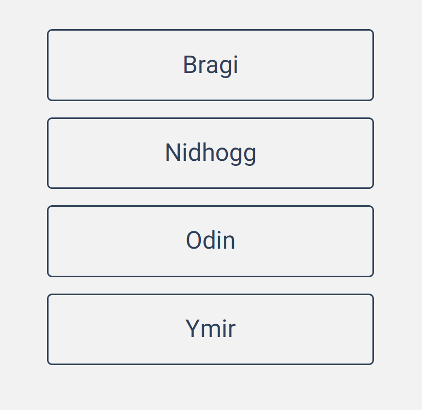
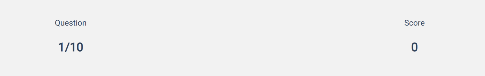
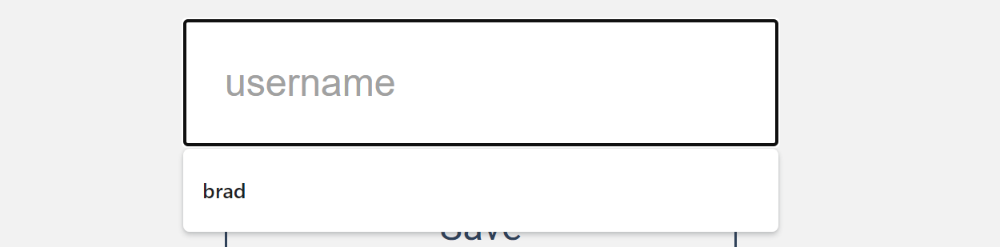

# Mythology Quiz

## Summary

### The Mythology Quiz tests the user on their knowledge of mythology from different cultures.

### The user is given ten multiple choice questions with the option to choose from one of four answers. The results are tallied and shows the user how many questions they have answered correctly which is displayed under the questions and a final score when the quiz is completed.

### The user can create a username and save their score at the end of the quiz. The score is saved locally. The quiz can be replayed again as many times as they like. The questions are displayed in random order so that each time the quiz is taken, the questions are not in the same order as the last.

# Features

* Mythology Quiz heading
  * Located at the top of the quiz

* Question
  * Quiz question will change to new question after it has been answered with a total of ten questions.

* Answer
  * Four multiple choice answers to choose from.
  * After selecting an answer, a new question will appear.

* Question and score tally
  * Keeps track of what question the user is on and number of correct answers.

* Final score
  * When the quiz is finished, the final score is displayed.

* Username
  * User can enter their username.

* Save and Play again
  * Player can save their score and play the quiz again.

# Colors used

# Testing

* I tested that this page works in different browsers: Chrome, Firefox, Microsoft Edge.
* I confirmed that this project is responsive, looks good and functions on all standard screen sizes using the devtools device toolbar.

## Validator Testing

* HTML
  * First page

* HTML
  * End page

* CSS

* JavaScript

## Bugs

* Fixed
  * Questions were not displaying correctly. The innerText under Fetch() needed to be changed to innerHTML.

* Unfixed
  * Before submitting project, I tested the site one last time. After answering the questions I got an error page. I have checked everything but cannot find the cause of the error. I have unfortunately run out of time to resolve the error.

# Deployment

* The site was deployed to GitHub pages. The steps to deploy are as follows:
  * In GitHub repository, navigate to Settings tab
  * Scroll down to GitHub pages and click on Check it out here!
  * From the source section drop-down menu, select the Main branch.
  Once the Main branch has been selected, the page provided the link to the completed website.

### The live link can be found here - https://bradleymurrell.github.io/Mythology-Quiz/

# Credits

## For help, advice and inspiration

* Simen Daehlin (Mentor)
* James Q Quick (YouTube)

## Content

* Multiple choice questions sourced from https://opentdb.com/