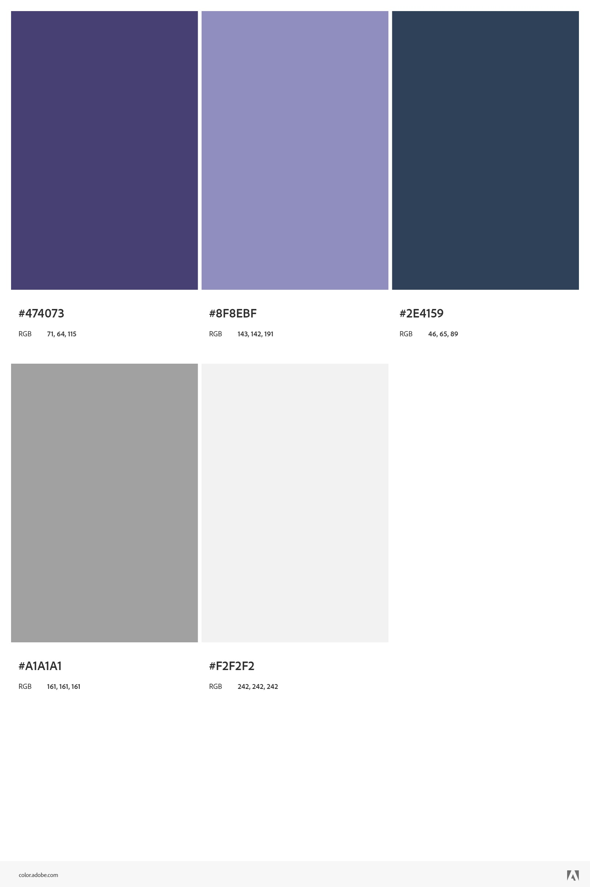

# Mythology Quiz

## Summary

### The Mythology Quiz tests the user on their knowledge of mythology from different cultures.

### The user is given ten multiple choice questions with the option to choose from one of four answers. The results are tallied and shows the user how many questions they have answered correctly which is displayed under the questions and a final score when the quiz is completed.

### The user can create a username and save their score at the end of the quiz. The score is saved locally. The quiz can be replayed again as many times as they like. The questions are displayed in random order so that each time the quiz is taken, the questions are not in the same order as the last.

# Features

# Colors used

# Testing

* I tested that this page works in different browsers: Chrome, Firefox, Microsoft Edge.
* I confirmed that this project is responsive, looks good and functions on all standard screen sizes using the devtools device toolbar.
* I confirmed that the navigation, header, about us, schedule, sign up and contact text are all readable and easy to understand.
* I have confirmed that the form works: requires entries in every field but one which is listed as optional, will only accept an email in the email field and the submit button works.

### Issues that I encountered during testing

* 
* 
* 

## Validator Testing

* HTML
  * 
* CSS
  * 
* Accessibility
  * 

## Bugs

# Deployment

* The site was deployed to GitHub pages. The steps to deploy are as follows:
  * In GitHub repository, navigate to Settings tab
  * Scroll down to GitHub pages and click on Check it out here!
  * From the source section drop-down menu, select the Main branch.
  Once the Main branch has been selected, the page provided the link to the completed website.

### The live link can be found here - https://bradleymurrell.github.io/Mythology-Quiz/

# Credits

## For help, advice and inspiration

* Simen Daehlin (Mentor)
* James Q Quick (YouTube)

## Content

* Multiple choice questions sourced from https://opentdb.com/